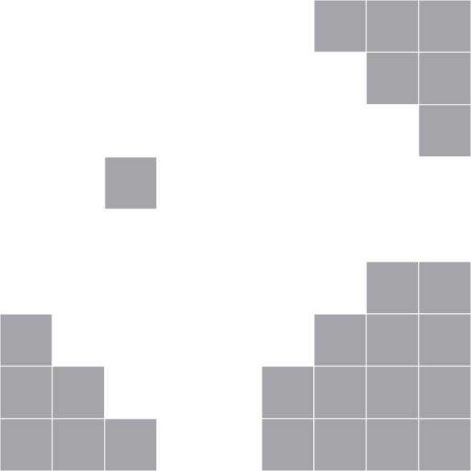
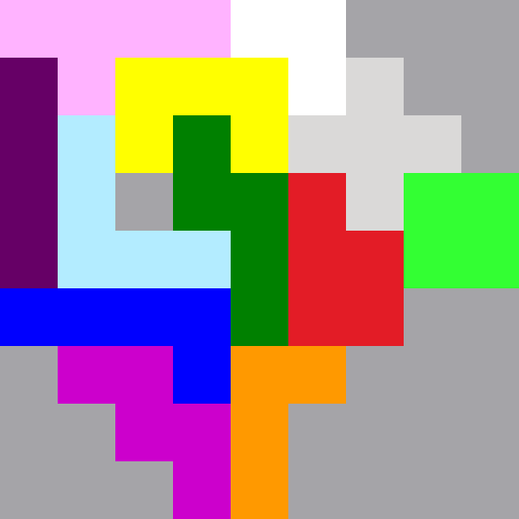

# Pentomino / Lonpos 2D Solver

This is one of my legacy projects from 2015, which is now brought back to life.

This programm implements a backtracking algorithm approach, in order to find all possible solutions for a pentomino / Lonpos puzzle game efficiently.

E.g. for the **Lonpos 66** puzzle it finds **21,200 different solutions**, as documented in the game's description.  
Different serializers make it possible to save the solutions, e.g. as `.png`  or `.svg` files.

Despite of the already implemented / configured game boards and puzzle pieces, one can add others, too.

To do that, you need to add new Stones in `src/main/java/Stones` and initialize them in `main()`.

## Examples

For an empty Lonpos 66 board **all 21,200** solutions are found in short time.

Serialized svg image of the Lonpos 66 board:

The following examples show two different solutions:

**You find all 21,200 solutions in <a href="res/svg_solutions/">res/svg_solutions/</a>**

## Build and Usage 

This is code was developed and tested on Fedora and Ubuntu.
The latest test happend on Ubuntu 20.04 with Maven 3.6.3 and OpenJDK 11. Just run `apt install maven` and run `mvn package` within this repo.  
The resulting `target/BrainBreakerSolver-1.0-SNAPSHOT.jar` is executable by running `java -jar target/BrainBreakerSolver-1.0-SNAPSHOT.jar`. It does not output something to the console, but will create a directory in `/tmp/`, in order to store the solution images.

### Custom boards and stone placements

You can create custom Boards as new classes in `src/java/Boards`.
Further, you occupy the fields as you wish and select which stones should be used for solving, by editing the code in `public static void main(String[] args)``